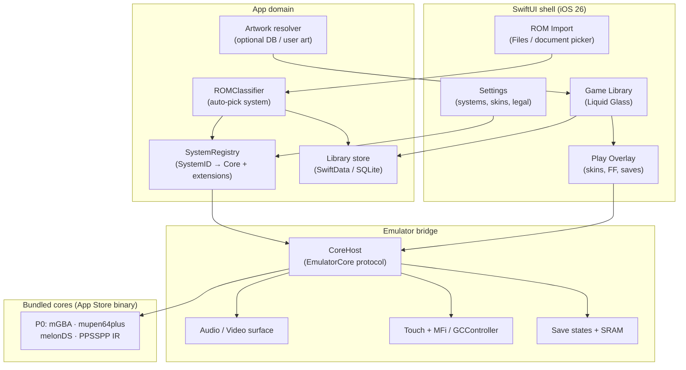

# SPEC.md — RetroPlay v1

**Status:** v1 product / engineering spec  
**Date:** 2026-09-04  
**Repo:** https://github.com/daniel-zn/retroplay (source of truth)  
**Agent pointer:** https://github.com/daniel-zn/grok-things/tree/main/Projects/retroplay  
**Fact-check:** Grok Build + primary sources, 2026-09-04 (migrated from GlassPlay research; **P0 locked** to GBA / N64 / NDS / PSP)

Claims below that depend on external products cite sources. Listing on RetroArch’s App Store page means **marketplace inclusion**, not a measured JIT-less FPS guarantee.

---

## 1. Goals

1. Ship a **native iPhone SwiftUI** emulator app with **Delta-simple UX**: a library of games, one tap to play, **automatic ROM → system → core** mapping (no RetroArch-style core picker in the main path).
2. Use **Liquid Glass** (iOS 26) as the visual language for chrome (library bars, sheets, play overlays) via SwiftUI `glassEffect` / `GlassEffectContainer` / `glassEffectID`.
3. Target the **App Store**: bundled, redistributable cores only; **no JIT**.
4. **Locked P0 only:** Game Boy Advance, Nintendo 64, Nintendo DS, and **Sony PSP** — all as App Store features. PSP uses PPSSPP’s IR caching interpreter (official 2024-05-15: nearly all games full speed on modern iOS without JIT). Do **not** park PSP as sideload-only.
5. Keep legal posture under **Guideline 4.7**: user-imported games only via Files / document picker; no ROM catalog shipped by us; developer responsibility for offered software.

**Success (v1):** Playable P0 library (GBA → N64 → NDS → PSP) on a real device / TestFlight path documented, Liquid Glass shell shipped, auto system detection working, one default core per P0 system, clear “out of scope” list for JIT-blocked systems and for NES/SNES/GB (not in locked P0).

---

## 2. Non-goals

- Not a RetroArch frontend, skin, or core-updater UI.
- Not “every libretro core” or parity with sideload RetroArch.
- Not NES / SNES / GB/GBC as P0 (explicitly out of locked matrix; future expansion only if scope changes).
- Not GameCube / Wii / Dreamcast / PS2 as App Store features (JIT / dynarec constraints — see matrix).
- Not distributing ROMs, BIOS packs, or copyrighted game dumps.
- Not inventing ROM file paths or sample dumps in the repo.
- Not claiming measured full-speed play for every title on every device without device testing.
- Not requiring jailbreak, AltStore JIT, or debugger-attached dynarec for the product path.
- Not inventing that an IPA/binary already exists.

---

## 3. System matrix (locked P0 + out of scope)

**Defaults used (proceed without asking Daniel):**  
P0 = **only** GBA, N64, NDS, PSP — Daniel-locked.  
NES/SNES/GB are **not** P0 even though Delta ships them.  
**Out of scope (store):** systems that require JIT to enable or that maintainers say are unplayable without JIT.

### P0 — ship these (ordered milestones GBA → N64 → NDS → PSP)

| System | Default core (bundled) | JIT note | Evidence |
|--------|------------------------|----------|----------|
| **Game Boy Advance** | **mGBA** | Not named by libretro as JIT-required. Prefer over Delta’s visualboyadvance-m for accuracy + active maintenance; MPL 2.0; on RetroArch App Store core set. | [mGBA](https://mgba.io/); [libretro mGBA](https://docs.libretro.com/library/mgba/); [Delta README](https://github.com/rileytestut/Delta) (ships VBA-M — store precedent for GBA UX, different core); [RA listing](https://apps.apple.com/us/app/retroarch/id6499539433) |
| **Nintendo 64** | **mupen64plus** / mupen64plus-next class | Store-viable; Delta ships mupen64plus on App Store. | [Delta README](https://github.com/rileytestut/Delta); [Delta App Store](https://apps.apple.com/us/app/delta-game-emulator/id1048524688) |
| **Nintendo DS** | **melonDS** | Store-viable; Delta ships melonDS; BIOS optional per Delta 1.6 notes. | same |
| **Sony PSP** | **PPSSPP** (IR caching interpreter; **no dynarec**) | Official: JIT **speeds up**, not required. App Store build uses IR interpreter; nearly all PSP games full speed on modern iOS without JIT. **App Store P0 — not sideload-only.** | [PPSSPP 2024-05-15](https://www.ppsspp.org/news/live-on-app-store/); [PPSSPP iOS](https://www.ppsspp.org/docs/reference/ios-support/); [libretro iOS](https://docs.libretro.com/guides/install-ios/); `CPUCore::IR_INTERPRETER = 2` in [ConfigValues.h](https://github.com/hrydgard/ppsspp/blob/master/Core/ConfigValues.h) |

#### Core pick rationale (locked)

| System | Pick | Why this one |
|--------|------|--------------|
| GBA | mGBA | Clearer long-term accuracy/maintenance than VBA-M; redistributable (MPL 2.0); already shipped in RetroArch marketplace builds. Delta’s VBA-M proves GBA-on-store UX, not that VBA-M is mandatory. |
| N64 | mupen64plus | Direct Delta App Store precedent; no competing store-proven alternative needed for v1. |
| NDS | melonDS | Direct Delta App Store precedent. |
| PSP | PPSSPP | Only credible App Store–proven PSP path; standalone listing + RA `ppsspp` core; IR path documented by upstream. |

### Explicitly not P0 (do not revive without scope change)

NES (Nestopia), SNES (Snes9x), GB/GBC (Gambatte) — Delta ships them; RetroPlay locked P0 does **not**. Treat as future expansion candidates only.

### Out of scope for App Store JIT-less RetroPlay

| System | Why blocked | Evidence |
|--------|-------------|----------|
| **GameCube / Wii (Dolphin)** | Not on live RA iOS systems list; not in RA iOS `appstore_cores`; Dolphin/DolphiniOS: interpreter unplayable; will not ship App Store without JIT | [RA listing](https://apps.apple.com/us/app/retroarch/id6499539433); [update-cores.sh](https://github.com/libretro/RetroArch/blob/master/pkg/apple/update-cores.sh); [OatmealDome 2024-04-19](https://oatmealdome.me/blog/why-dolphin-isnt-coming-to-the-app-store/); [DolphiniOS FAQ](https://dolphinios.oatmealdome.me/faq) |
| **Dreamcast (Flycast)** | Libretro iOS docs: JIT **enables** Flycast; `#flycast` commented out of iOS App Store cores | [libretro iOS](https://docs.libretro.com/guides/install-ios/); [update-cores.sh](https://github.com/libretro/RetroArch/blob/master/pkg/apple/update-cores.sh) |
| **PlayStation 2** | `#play` commented out of iOS App Store cores; not on live RA iOS systems list | same |
| **3DS / Switch** | Not in live RetroArch App Store systems list retrieved 2026-09-04 | [RA listing](https://apps.apple.com/us/app/retroarch/id6499539433) |

**Libretro JIT summary (official):** App Store RetroArch has **no JIT**. Dynarec **speeds up** some cores (e.g. **ppsspp**) and **enables** others (e.g. **flycast**). Cores are signed into the binary; no runtime core install. Source: [https://docs.libretro.com/guides/install-ios/](https://docs.libretro.com/guides/install-ios/) (retrieved 2026-09-04).

---

## 4. Architecture

### 4.1 Principles

- **SwiftUI app shell** owns library, import, settings, Liquid Glass chrome.
- **EmulatorCore bridge** (DeltaCore-style protocol) owns audio/video/input frames and save states.
- **One bundled core plugin per system**. Hide core choice from users; optional advanced override later.
- **ROM classifier** maps extension + header/magic → `SystemID` → default core.
- ROM import via **Files / UIDocumentPicker** only — copy into app sandbox; never invent sample ROM paths in source.
- No RetroArch menu tree; no online core updater.

### 4.2 Diagram

### 4.3 Module sketch (v1)

| Module | Responsibility |
|--------|----------------|
| `RetroPlayApp` | Entrypoint, scene, appearance |
| `LibraryFeature` | Grid/list, search, recent, system filters |
| `ImportFeature` / `ROMImporter` | Document picker, folder import, duplicate detection |
| `SystemRegistry` | Static map of systems, extensions, default cores |
| `ROMClassifier` | Heuristics + magic bytes |
| `EmulatorCore` + `CoreHost` | Protocol + load core, run loop, pause, FF, save/load state |
| `SkinKit` | On-screen controls; system default skins |
| `GlassChrome` | Shared `glassEffect` helpers / containers |

Scaffold lives under `App/` (see `App/README.md`). No bulky emulator repos cloned yet.

---

## 5. App Store constraints

| Constraint | Implication | Source |
|------------|-------------|--------|
| Guideline **4.7** (5 Apr 2024; PC wording 1 Aug 2024) | Retro console (and PC) emulator apps may offer downloadable games; developer is responsible for compliance and law | [Apple News 2024-04-05](https://developer.apple.com/news/?id=0kjli9o1); [Guidelines](https://developer.apple.com/app-store/review/guidelines/) |
| 4.7.1–4.7.5 | Privacy, filtering/reporting, payments if selling content, no exposing native APIs to downloaded software without permission, software index + universal links, age gating | same Guidelines page |
| **No JIT** on App Store | Do not ship dynarec-required systems; use interpreter/IR paths only (PPSSPP IR for PSP) | [libretro iOS](https://docs.libretro.com/guides/install-ios/); [PPSSPP](https://www.ppsspp.org/news/live-on-app-store/) |
| Cores **bundled** | No post-install core downloads as executable plugins | [libretro iOS](https://docs.libretro.com/guides/install-ios/) |
| Guideline **2.5.2** | Do not download/execute code that changes app features | [Guidelines](https://developer.apple.com/app-store/review/guidelines/) |
| Copyright | User supplies ROMs via Files; we do not distribute game dumps; document ToS clearly | 4.7 responsibility language |
| Redistribution | Prefer cores with clear licenses / upstream marketplace approval | [libretro iOS — App Store vs Sideloading](https://docs.libretro.com/guides/install-ios/) |

**Precedents (store live after 4.7):** Delta (~17 Apr 2024), RetroArch (~15 May 2024), PPSSPP (~15 May 2024).

---

## 6. Liquid Glass UI outline (iOS 26)

**Confirmed APIs (Apple Developer Documentation, availability iOS 26.0+):**

| API | Role |
|-----|------|
| `View.glassEffect(_:in:)` | Apply Liquid Glass to a view (default `.regular`, capsule shape) |
| `GlassEffectContainer` | Shared sampling / morphing for multiple glass views |
| `View.glassEffectID(_:in:)` | Identity for morph transitions inside a container |

Guide: [Applying Liquid Glass to custom views](https://developer.apple.com/documentation/swiftui/applying-liquid-glass-to-custom-views)  
Also: [glassEffect(_:in:)](https://developer.apple.com/documentation/swiftui/view/glasseffect(_:in:)), [GlassEffectContainer](https://developer.apple.com/documentation/swiftui/glasseffectcontainer), WWDC25 session [323](https://developer.apple.com/videos/play/wwdc2025/323/) (2025-06-09).  
Apple DTS note: no back-deployed equivalent before iOS 26 ([forums thread](https://developer.apple.com/forums/thread/840052)).

### UI map

| Surface | Treatment |
|---------|-----------|
| Tab / toolbar / floating library actions | `GlassEffectContainer` + `.glassEffect(.regular.interactive())` where touch-primary |
| Game detail sheet / pause menu | Glass sheet over dimmed playfield |
| On-screen controls | Prefer non-interactive glass for dense chrome; interactive for primary pause/FF |
| Game artwork grid | Content stays opaque; glass only on chrome (performance) |
| Fallback | v1 min = **iOS 26** so Liquid Glass is first-class |

---

## 7. PPSSPP IR defaults + heavy-title edge cases

### App Store defaults (product path)

| Setting | Value | Notes |
|---------|-------|-------|
| `CPUCore` | **`IR_INTERPRETER` (2)** | Enum: `INTERPRETER=0`, `JIT=1`, `IR_INTERPRETER=2`, `JIT_IR=3` — [ConfigValues.h](https://github.com/hrydgard/ppsspp/blob/master/Core/ConfigValues.h) |
| Dynarec / JIT | **Off / unavailable** | App Store cannot use JIT; do not expose a “enable JIT” product path |
| Claim | Nearly all PSP games full speed on modern iOS without JIT | [PPSSPP 2024-05-15](https://www.ppsspp.org/news/live-on-app-store/) |

### Edge cases (IR path)

Upstream tracks IR-specific instability separately from JIT ([issue #15670](https://github.com/hrydgard/ppsspp/issues/15670)). Historically named titles (many later fixed): Burnout Legends, Metal Gear Solid: Peace Walker, Dissidia 012, Frontier Gate Boost; Outrun 2006 called out as remaining. For RetroPlay:

- Ship IR as the **only** App Store CPU backend for PSP.
- Keep a buried “compatibility” note for known-heavy titles; prefer upstream fixes over inventing per-game hacks in v1.
- Do not advertise sideload JIT as the product solution for those titles.
- Device-tier testing before claiming full-speed on older phones.

---

## 8. ROM import (Files only)

- Use `UIDocumentPicker` / SwiftUI `.fileImporter` / Files app share sheet.
- Supported extensions registered per `SystemID` (see `App/Sources/RetroPlayCore/SystemID.swift`).
- Copy security-scoped bookmarks into the app sandbox library store.
- **Never** commit, generate, or hardcode paths to copyrighted ROMs or BIOS dumps.
- Empty-state copy: “Import games you own via Files. RetroPlay does not include ROMs.”

---

## 9. Milestones M0–M3 (ordered GBA → N64 → NDS → PSP)

### M0 — Skeleton (current / next)

- Swift package / Xcode-friendly tree under `App/`.
- Library shell with Liquid Glass chrome; empty state; Settings with legal / “no ROMs included” copy.
- `SystemID` + `SystemRegistry` + stub `ROMImporter` / classifier (extension map for four P0 systems).
- Document picker import → library row (no emulation yet).
- README pointing at SPEC.

### M1 — First playable: **GBA (mGBA)**

- Bridge + **mGBA** end-to-end.
- Touch skin + MFi basics; save SRAM; pause overlay.
- Auto-detect `.gba` / related; reject unknown with clear UI.

### M2 — **N64 (mupen64plus)** + **NDS (melonDS)**

- Second and third P0 systems.
- Box art hook (user art + optional open DB — no piracy catalog).
- Save states, fast-forward, per-game recent.
- TestFlight checklist + 4.7 compliance notes.

### M3 — **PSP (PPSSPP IR)** + polish

- Integrate PPSSPP with **IR interpreter defaults** (no dynarec).
- Heavy-title edge-case notes; performance pass on device tiers.
- Explicit “not supported” screen for GC/Wii/Dreamcast/PS2 (and for NES/SNES/GB until scope expands).
- Only then consider App Store submission prep (screenshots, privacy nutrition, age rating).

---

## 10. Open questions for Daniel

Only items that are **costly** if wrong. Everything else defaulted above.

1. **Bundle ID / Apple Developer team / paid account** — needed before signing or TestFlight; not blocking M0 source scaffolding on disk.

No other blockers; proceed on defaults. Display name is **RetroPlay**. Product home is this public repo.

---

## 11. Next build step

**Wire M0 UI:** Liquid Glass library shell + Settings legal copy + connect `ROMImporter` document picker to persistent library rows (still stub cores). Then start **M1 mGBA** integration when ready to vendor/build the core (without cloning bulky trees into git until asked).

---

## 12. References (retrieved 2026-09-04 unless dated)

- Libretro iOS install / JIT: https://docs.libretro.com/guides/install-ios/
- RetroArch App Store: https://apps.apple.com/us/app/retroarch/id6499539433
- RetroArch Apple core export script: https://github.com/libretro/RetroArch/blob/master/pkg/apple/update-cores.sh
- Delta: https://github.com/rileytestut/Delta · https://apps.apple.com/us/app/delta-game-emulator/id1048524688
- Apple 4.7 news (2024-04-05): https://developer.apple.com/news/?id=0kjli9o1
- Apple 4.7 PC clarification (2024-08-01): https://developer.apple.com/news/?id=ty0avr2s
- App Review Guidelines: https://developer.apple.com/app-store/review/guidelines/
- PPSSPP App Store (2024-05-15): https://www.ppsspp.org/news/live-on-app-store/
- PPSSPP iOS support: https://www.ppsspp.org/docs/reference/ios-support/
- PPSSPP ConfigValues.h (CPUCore): https://github.com/hrydgard/ppsspp/blob/master/Core/ConfigValues.h
- PPSSPP IR issues tracker: https://github.com/hrydgard/ppsspp/issues/15670
- mGBA: https://mgba.io/ · https://docs.libretro.com/library/mgba/
- DolphiniOS / no App Store JIT (2024-04-19): https://oatmealdome.me/blog/why-dolphin-isnt-coming-to-the-app-store/
- Liquid Glass guide: https://developer.apple.com/documentation/swiftui/applying-liquid-glass-to-custom-views
