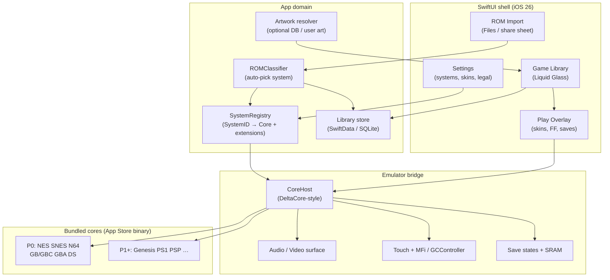

# SPEC.md — RetroPlay v1

**Status:** v1 product / engineering spec  
**Date:** 2026-09-04  
**Handoff:** see `CONTEXT.md` in this folder  
**Fact-check:** Grok Build (grok-4.6, `--reasoning-effort xhigh`, web search) + primary sources, 2026-09-04  

Claims below that depend on external products cite sources. Listing on RetroArch’s App Store page means **marketplace inclusion**, not a measured JIT-less FPS guarantee.

---

## 1. Goals

1. Ship a **native iPhone SwiftUI** emulator app with **Delta-simple UX**: a library of games, one tap to play, **automatic ROM → system → core** mapping (no RetroArch-style core picker in the main path).
2. Use **Liquid Glass** (iOS 26) as the visual language for chrome (library bars, sheets, play overlays) via SwiftUI `glassEffect` / `GlassEffectContainer` / `glassEffectID`.
3. Target the **App Store**: bundled, redistributable cores only; **no JIT**; grow a practical JIT-less system matrix over milestones.
4. Match or beat Delta’s clarity for Nintendo-class systems in P0, then expand toward systems already proven on store (PSP standalone, RetroArch App Store listing) without becoming a RetroArch skin.
5. Keep legal posture under **Guideline 4.7**: user-imported games only; no ROM catalog shipped by us; developer responsibility for offered software.

**Success (v1):** Playable P0 library on a real device / TestFlight path documented, Liquid Glass shell shipped, auto system detection working, one default core per P0 system, clear “out of scope” list for JIT-blocked systems.

---

## 2. Non-goals

- Not a RetroArch frontend, skin, or core-updater UI.
- Not “every libretro core” or parity with sideload RetroArch.
- Not GameCube / Wii / Dreamcast / PS2 as App Store features (JIT / dynarec constraints — see matrix).
- Not distributing ROMs, BIOS packs, or copyrighted game dumps.
- Not claiming measured full-speed play for every system on every device without device testing.
- Not requiring jailbreak, AltStore JIT, or debugger-attached dynarec for the product path.
- Not inventing that an IPA/binary already exists.

---

## 3. System matrix (P0 / P1 / P2 + JIT notes)

**Defaults used (proceed without asking Daniel):**  
P0 = systems Delta already ships on the App Store (proven JIT-less UX path).  
P1 = strong next systems with RetroArch App Store listing and/or standalone JIT-less precedent.  
P2 = listed on RetroArch but niche / heavier / unverified at full speed without device tests.  
**Out of scope (store):** systems that require JIT to enable or that maintainers say are unplayable without JIT.

### P0 — ship first (Delta App Store systems)

| System | Suggested core family (bundled) | JIT note | Evidence |
|--------|----------------------------------|----------|----------|
| NES / Famicom | Nestopia (Delta) / Nestopia UE class | Not named by libretro as JIT-required | [Delta README](https://github.com/rileytestut/Delta); [Delta App Store](https://apps.apple.com/us/app/delta-game-emulator/id1048524688) |
| SNES / SFC | Snes9x (Delta) | Same | same |
| N64 | mupen64plus (Delta) | Same; treat as store-viable (Delta ships it) | same |
| Game Boy / Color | Gambatte (Delta) | Same | same |
| Game Boy Advance | visualboyadvance-m (Delta) | Same | same |
| Nintendo DS | melonDS (Delta) | Same; BIOS optional per Delta 1.6 notes | same |

### P1 — next wave (store-listed / JIT-less precedent)

| System | Suggested core family | JIT note | Evidence |
|--------|----------------------|----------|----------|
| Sega Genesis / Mega Drive (+ MS/GG when same core family) | Genesis Plus GX | Not JIT-enable-only; Delta README marks Genesis **beta**; live Delta listing does **not** advertise it yet → RetroPlay can take it as P1 | [RA listing](https://apps.apple.com/us/app/retroarch/id6499539433); [Delta README](https://github.com/rileytestut/Delta) |
| Sony PlayStation (PS1) | Beetle PSX / PCSX ReARMed class (prefer redistributable App Store–approved build) | On live RA systems list; **not** named as JIT-enable-only (unlike Flycast). Speed TBD on device | [RA listing](https://apps.apple.com/us/app/retroarch/id6499539433); [update-cores.sh](https://github.com/libretro/RetroArch/blob/master/pkg/apple/update-cores.sh); [libretro iOS JIT](https://docs.libretro.com/guides/install-ios/) |
| Sony PSP | PPSSPP | Official: JIT **speeds up**, not required; PPSSPP states nearly all PSP games full speed on iOS without JIT (IR interpreter) | [PPSSPP 2024-05-15](https://www.ppsspp.org/news/live-on-app-store/); [libretro iOS](https://docs.libretro.com/guides/install-ios/) |
| NEC PC Engine / SuperGrafx / CD | Beetle PCE / Geargrafx class | On live RA listing | [RA listing](https://apps.apple.com/us/app/retroarch/id6499539433) |
| WonderSwan / Neo Geo Pocket / Atari 2600·7800·Lynx / ColecoVision / Virtual Boy | Matching libretro cores already on RA App Store list | 8/16-bit class; not named JIT-enable-only | same |

### P2 — later / niche (listed; verify playability before advertising)

| System | Caution | Evidence |
|--------|---------|----------|
| Sega Saturn | On live RA listing; no official libretro iOS doc asserting JIT-less full-speed play | [RA listing](https://apps.apple.com/us/app/retroarch/id6499539433) |
| Sega CD / 32X, Neo Geo AES/MVS/CD, 3DO, arcade (selected), DOS/ScummVM | Listed on RA; higher complexity (CD, BIOS, timing, legal BIOS handling) | same |
| N64 / DS edge cases | Already P0 for baseline; hard titles may need per-game settings — keep advanced options buried | Delta precedent |

### Out of scope for App Store JIT-less RetroPlay

| System | Why blocked | Evidence |
|--------|-------------|----------|
| **GameCube / Wii (Dolphin)** | Not on live RA iOS systems list; not in RA iOS `appstore_cores`; Dolphin/DolphiniOS: interpreter unplayable; will not ship App Store without JIT | [RA listing](https://apps.apple.com/us/app/retroarch/id6499539433); [update-cores.sh](https://github.com/libretro/RetroArch/blob/master/pkg/apple/update-cores.sh); [OatmealDome 2024-04-19](https://oatmealdome.me/blog/why-dolphin-isnt-coming-to-the-app-store/); [DolphiniOS FAQ](https://dolphinios.oatmealdome.me/faq) |
| **Dreamcast (Flycast)** | Libretro iOS docs: JIT **enables** Flycast; `#flycast` commented out of iOS App Store cores (macOS App Store only); Dreamcast not on live RA iOS systems list | [libretro iOS](https://docs.libretro.com/guides/install-ios/); [update-cores.sh](https://github.com/libretro/RetroArch/blob/master/pkg/apple/update-cores.sh) |
| **PlayStation 2** | `#play` commented out of iOS App Store cores; not on live RA iOS systems list | [update-cores.sh](https://github.com/libretro/RetroArch/blob/master/pkg/apple/update-cores.sh); [RA listing](https://apps.apple.com/us/app/retroarch/id6499539433) |
| **3DS / Switch** | Not in live RetroArch App Store systems list retrieved 2026-09-04 | [RA listing](https://apps.apple.com/us/app/retroarch/id6499539433) |

**Libretro JIT summary (official):** App Store RetroArch has **no JIT**. Dynarec **speeds up** some cores (e.g. **ppsspp**) and **enables** others (e.g. **flycast**). Cores are signed into the binary; no runtime core install. Source: [https://docs.libretro.com/guides/install-ios/](https://docs.libretro.com/guides/install-ios/) (retrieved 2026-09-04).

---

## 4. Architecture

### 4.1 Principles

- **SwiftUI app shell** owns library, import, settings, Liquid Glass chrome.
- **Emulator bridge** (DeltaCore-style) owns audio/video/input frames and save states.
- **One bundled core plugin per system** (or thin wrappers around redistributable cores). Hide core choice from users; optional advanced override later.
- **ROM classifier** maps extension + header/magic → `SystemID` → default core.
- No RetroArch menu tree; no online core updater.

### 4.2 Diagram

### 4.3 Module sketch (v1)

| Module | Responsibility |
|--------|----------------|
| `RetroPlayApp` | Entrypoint, scene, appearance |
| `LibraryFeature` | Grid/list, search, recent, system filters |
| `ImportFeature` | Document picker, folder import, duplicate detection |
| `SystemRegistry` | Static map of systems, extensions, default cores |
| `ROMClassifier` | Heuristics + magic bytes |
| `CoreHost` | Load core, run loop, pause, FF, save/load state |
| `SkinKit` | On-screen controls; system default skins |
| `GlassChrome` | Shared `glassEffect` helpers / containers |

---

## 5. App Store constraints

| Constraint | Implication | Source |
|------------|-------------|--------|
| Guideline **4.7** (5 Apr 2024; PC wording 1 Aug 2024) | Retro console (and PC) emulator apps may offer downloadable games; developer is responsible for compliance and law | [Apple News 2024-04-05](https://developer.apple.com/news/?id=0kjli9o1); [Guidelines](https://developer.apple.com/app-store/review/guidelines/) |
| 4.7.1–4.7.5 | Privacy, filtering/reporting, payments if selling content, no exposing native APIs to downloaded software without permission, software index + universal links, age gating | same Guidelines page |
| **No JIT** on App Store | Do not ship dynarec-required systems; use interpreter/IR paths only | [libretro iOS](https://docs.libretro.com/guides/install-ios/); [PPSSPP](https://www.ppsspp.org/news/live-on-app-store/) |
| Cores **bundled** | No post-install core downloads as executable plugins | [libretro iOS](https://docs.libretro.com/guides/install-ios/) |
| Guideline **2.5.2** | Do not download/execute code that changes app features | [Guidelines](https://developer.apple.com/app-store/review/guidelines/) |
| Copyright | User supplies ROMs; we do not distribute game dumps; document ToS clearly | 4.7 responsibility language |
| Redistribution | Prefer cores with clear licenses / upstream marketplace approval (same bar as RetroArch App Store cores) | [libretro iOS — App Store vs Sideloading](https://docs.libretro.com/guides/install-ios/) |

**Precedents (store live after 4.7):** Delta (~17 Apr 2024), RetroArch (~15 May 2024), PPSSPP (~15 May 2024).

---

## 6. Liquid Glass UI outline (iOS 26)

**Confirmed APIs (Apple Developer Documentation, availability iOS 26.0+):**

| API | Role |
|-----|------|
| `View.glassEffect(_:in:)` | Apply Liquid Glass to a view (default `.regular`, capsule shape) |
| `GlassEffectContainer` | Shared sampling / morphing for multiple glass views |
| `View.glassEffectID(_:in:)` | Identity for morph transitions inside a container |

Guide: [Applying Liquid Glass to custom views](https://developer.apple.com/documentation/swiftui/applying-liquid-glass-to-custom-views)  
Also: [glassEffect(_:in:)](https://developer.apple.com/documentation/swiftui/view/glasseffect(_:in:)), [GlassEffectContainer](https://developer.apple.com/documentation/swiftui/glasseffectcontainer), WWDC25 session [323](https://developer.apple.com/videos/play/wwdc2025/323/) (2025-06-09).  
Apple DTS note: no back-deployed equivalent before iOS 26 ([forums thread](https://developer.apple.com/forums/thread/840052)).

### UI map

| Surface | Treatment |
|---------|-----------|
| Tab / toolbar / floating library actions | `GlassEffectContainer` + `.glassEffect(.regular.interactive())` where touch-primary |
| Game detail sheet / pause menu | Glass sheet over dimmed playfield |
| On-screen controls | Prefer non-interactive glass for dense chrome; interactive for primary pause/FF |
| Game artwork grid | Content stays opaque; glass only on chrome (performance) |
| Fallback | If min OS ever drops below 26 (not planned for v1), replace with materials — **v1 min = iOS 26** |

**Default:** minimum deployment **iOS 26** so Liquid Glass is first-class, not a #available garnish.

---

## 7. Milestones M0–M3

### M0 — Skeleton (next build step)

- Xcode project / SwiftUI app target named RetroPlay (still under `Projects/glassplay/` or dedicated repo when Daniel asks).
- Library shell with Liquid Glass chrome; empty state; Settings with legal / “no ROMs included” copy.
- `SystemRegistry` + stub `ROMClassifier` (extension map for P0).
- Document picker import → library row (no emulation yet).
- README in this folder pointing at CONTEXT + SPEC.

### M1 — First playable P0 slice

- Bridge + **one** P0 core end-to-end (recommend **GBA** or **GBC** for fastest path).
- Touch skin + MFi basics; save SRAM; pause overlay.
- Auto-detect for that system’s extensions; reject/ignore unknown with clear UI.

### M2 — Full P0 matrix + Delta-class library UX

- Remaining P0 systems (NES, SNES, N64, GB/GBC, GBA, DS).
- Box art hook (user art + optional open DB — no piracy catalog).
- Save states, fast-forward, per-game recent.
- TestFlight checklist + 4.7 compliance notes.

### M3 — P1 expansion + polish

- Genesis (+ MS/GG), PS1, PSP (PPSSPP path), then lighter P1 handhelds.
- Skin pack polish; performance pass on device tiers.
- Explicit “not supported” screen for GC/Wii/Dreamcast/PS2 attempts.
- Only then consider App Store submission prep (screenshots, privacy nutrition, age rating).

---

## 8. Open questions for Daniel

Only items that are **costly** if wrong. Everything else defaulted above.

1. **Bundle ID / Apple Developer team / paid account** — needed before signing or TestFlight; not blocking M0 source scaffolding on disk.
2. **Dedicated GitHub repo vs stay in `grok-things/Projects/glassplay/`** — default: stay here until he asks.
3. **Display name “RetroPlay” vs rename before first TestFlight** — default: keep RetroPlay.

No other blockers; proceed on defaults.

---

## 9. References (retrieved 2026-09-04 unless dated)

- Libretro iOS install / JIT: https://docs.libretro.com/guides/install-ios/
- RetroArch App Store: https://apps.apple.com/us/app/retroarch/id6499539433
- RetroArch Apple core export script: https://github.com/libretro/RetroArch/blob/master/pkg/apple/update-cores.sh
- Delta: https://github.com/rileytestut/Delta · https://apps.apple.com/us/app/delta-game-emulator/id1048524688
- Apple 4.7 news (2024-04-05): https://developer.apple.com/news/?id=0kjli9o1
- Apple 4.7 PC clarification (2024-08-01): https://developer.apple.com/news/?id=ty0avr2s
- App Review Guidelines: https://developer.apple.com/app-store/review/guidelines/
- PPSSPP App Store (2024-05-15): https://www.ppsspp.org/news/live-on-app-store/
- DolphiniOS / no App Store JIT (2024-04-19): https://oatmealdome.me/blog/why-dolphin-isnt-coming-to-the-app-store/
- Liquid Glass guide: https://developer.apple.com/documentation/swiftui/applying-liquid-glass-to-custom-views
